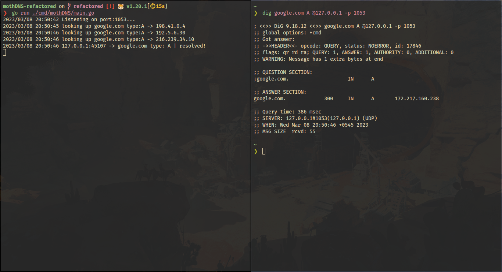

 
# mothDNS

mothDNS is a basic recursive DNS server implementation that follows the conventions given by RFC 1035. It is implemented without the use of any external libraries other than the standard libraries provided by Go. This passion project was created to learn about DNS and DNS servers, with a special focus on learning Golang. Please note that this project is mainly for educational purposes.

## Running the server
- run the command below from inside project directory
```shell
 $ go run ./cmd/mothDNS/main.go
```

## Snapshots



